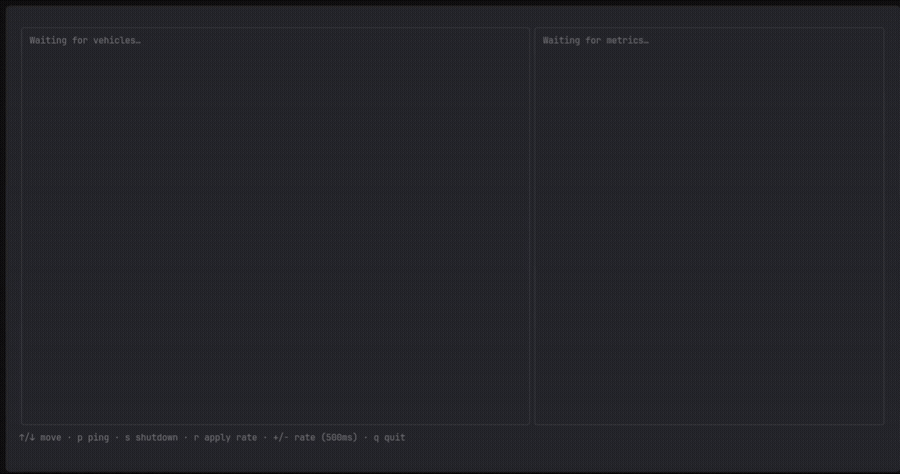

# Fleet Management Platform (Real-Time Telemetry & Control)

A real-time fleet management system that ingests telemetry from thousands of simulated vehicles, allows live control commands, and streams aggregated fleet metrics to clients.

Built to explore distributed systems, gRPC streaming, and async backends using **Rust** and **Go**.

## Demo



---

## Features

### Bidirectional gRPC Streaming
- **Vehicles stream telemetry** to the ingestion server.
- **Server streams commands** back to individual vehicles.

### Live Command Routing
- Target a specific vehicle with the following commands:
  - `PING`
  - `UPDATE_RATE`
  - `SHUTDOWN`

### Vehicle Registry
- Tracks connected vehicles using async-safe structures.

### Fleet-Wide Metrics
- **Active vehicles**
- **Low battery vehicles**
- **Average speed and engine temperature**

### Metrics Streaming via SSE
- HTTP clients receive live fleet updates via Server-Sent Events (SSE).

### Prometheus & Grafana Monitoring
- **Real-time monitoring** of connections, telemetry processing, and command routing
- **Grafana-ready** metrics for dashboard visualization
- **Production-grade** monitoring with histograms and counters

### Graceful Shutdown
- **Clean server termination** with proper connection draining
- **Resource cleanup** preventing memory leaks

### Multi-Language System
- **Rust**: Ingestion and metrics server
- **Go**: Vehicle simulator and control API

### System Components
- **Rust** → Ingestion + metrics engine (high-performance async processing)
- **Go** → Vehicle simulator + control API
- **Go (TUI)** → Real-time terminal dashboard for monitoring and control

---

## Example Metrics

- Active vehicles
- Low battery vehicles
- Average speed
- Average engine temperature

---

## Getting Started

Follow these steps to get the system running locally:

## 1. Install golang grpc packages

```bash
go install google.golang.org/protobuf/cmd/protoc-gen-go@latest
go install google.golang.org/grpc/cmd/protoc-gen-go-grpc@latest
```

### 2. Start Ingestion Server
To run the ingestion server (written in **Rust**), execute the following command:

```bash
cargo run
```

The server will start on:
- **gRPC server**: `0.0.0.0:50051`
- **Metrics server**: `http://0.0.0.0:9090/metrics`

### 3. Start Control API
To run the control API (written in Go), execute the following command:

```bash
go run main.go
```

### 4. Start Vehicle Simulator
To start the vehicle simulator (also written in Go), execute the following command:

```bash
go run main.go
```

### 5. Monitor with Prometheus & Grafana (Optional)

```bash
docker-compose up -d
```

Access the dashboards:
- **Prometheus**: http://localhost:9091
- **Grafana**: http://localhost:3000 (admin/admin)

